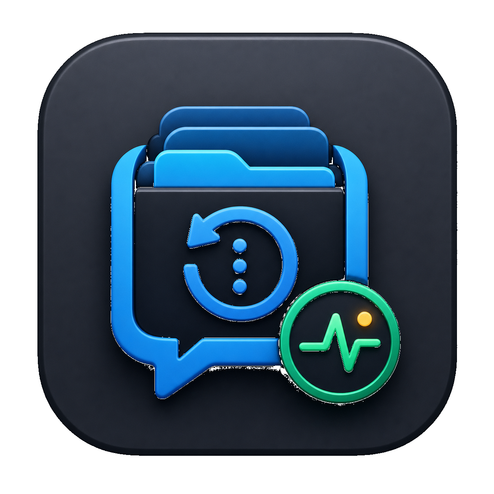

<p align="center">
  
</p>

<h1 align="center">Codex Enhance Manager</h1>

<p align="center">
  <strong>让 Codex 尽量保持原生，同时补上它本该有的控制台。</strong>
</p>

<p align="center">
  官方登录切换 · 本地代理路由 · 智能路由 · Token 监控 · 配置修复
</p>

<p align="center">
  <a href="README.md">English</a>
  ·
  <a href="https://github.com/JiangNanGenius/Codex-Enhance-Manager/releases">下载发布版</a>
  ·
  <a href="RELEASE_NOTES.md">更新日志</a>
  ·
  <a href="LICENSE">许可证</a>
</p>

<p align="center">
  
  
  
  
</p>

---

## 为什么要做它

Codex 最舒服的状态应该是：官方登录态还在，启动像原生一样顺，历史记录能看，用量能看，供应商和模型可以换，但不会把配置文件搞成一团。

Codex Enhance Manager 做的就是这件事：尽量不破坏 Codex 原生体验，把供应商、路由、智能路由、用量统计、备份恢复、配置修复和悬浮窗放进一个本地 Windows 桌面工具里。

所有配置、供应商、请求元数据、诊断包、备份和导出默认都留在本机。

## 一眼看懂

<table>
  <tr>
    <td width="50%">
      <strong>官方登录态不乱动</strong><br>
      能识别 ChatGPT/OAuth 登录，显示真实的 OpenAI 官方状态和当前模型；官方直连只做切换，不进本地代理和智能路由。
    </td>
    <td width="50%">
      <strong>要路由时才路由</strong><br>
      需要代理/API 模式时才启动本地代理；端口被占用会自动退避，并把真实端口和强 bearer token 写进 Codex 配置。
    </td>
  </tr>
  <tr>
    <td width="50%">
      <strong>供应商和轮换分清楚</strong><br>
      供应商页管密钥、地址、Header、模型能力和媒体能力；智能路由页只管新会话顺序、优先级、故障转移和能力匹配。
    </td>
    <td width="50%">
      <strong>真出问题也能修</strong><br>
      一键把 Codex 配置修回模板态；首次切回官方登录有风险提示和重置流程；备份可以清理，诊断会脱敏。
    </td>
  </tr>
</table>

## 三种连接模式

| 模式 | 适合谁 | 行为 |
| --- | --- | --- |
| 官方登录直连 | 想让 Codex 完全走官方账号的用户。 | 保留 OAuth 登录态，锁定会改变路由的供应商能力；安全的页面增强注入仍可开启。 |
| 保留登录并接入代理/API | 想保留官方登录，同时使用本地代理或 API 路由的用户。 | 启动本地代理，写入真实退避端口和强 token，再带进度同步历史记录。 |
| 第三方供应商 | 使用自定义供应商、代理商或兼容 API 的用户。 | 启用供应商密钥、Responses/Chat 协议选择、模型映射、媒体 fallback、额度脚本和智能路由。 |

## Codex 实际怎么请求模型

这里按 OpenAI Codex 当前源码设计来做，不猜传输层。Codex 会构造 Responses API 请求，并用 SSE 流式发送到 `POST /responses`。OpenAI 的 Codex agent-loop 文章也明确了同一套端点：ChatGPT 登录、API key、本地 provider 和云端 Responses provider 都围绕 `/responses`。

因此本工具的边界是：

- 写入 Codex 配置时只使用 `wire_api = "responses"`，并把 base URL 指向本地代理的 `/v1`。
- 原生 Responses 供应商会直通到上游 `/responses`，保留 Codex 的请求形态。
- 只有 Chat-only 供应商才由本地代理做 Responses 到 Chat Completions 的适配。
- **图像路由独立化**：直接 `POST /v1/images/generations` 请求以及国内代理（百炼、火山等）的 LLM-mediated 图像生成，都通过 AMR `image_candidates` 自动路由到最佳图像 provider；私有纯原生代理直接透传，代理层不干预。

参考：[openai/codex `responses.rs`](https://github.com/openai/codex/blob/main/codex-rs/codex-api/src/endpoint/responses.rs) 和 [OpenAI: Unrolling the Codex agent loop](https://openai.com/index/unrolling-the-codex-agent-loop/)。

## 你会得到什么

- 设置向导：Codex 路径、官方登录态、供应商、模型能力、路由、媒体 fallback、开机启动和保存检查。
- 供应商管理：一个供应商可配置多个模型，支持 Header、`User-Agent`、模型别名、能力标签和媒体路由。
- 智能路由：管理下一个新会话的顺序、优先级、故障转移和能力筛选，不和密钥配置混在一起。
- 用量统计：读取 Codex Token、官方登录态额度、缓存、代理请求元数据、本地费用估算，以及可用时的供应商官方扣费信息。
- 悬浮窗：显示 Token、缓存、上下文、一小时用量、消耗速度、余额扣费速率、套餐额度百分比、透明度、托盘操作和快速切换。
- 恢复工具：备份/恢复、配置模板修复、移动会话修复、脱敏诊断、更新检查和打包版 EXE 发布支持。

## 安全边界

- 默认数据目录是 `Documents/Codex Enhance Manager/`。
- API Key、Bearer Token 和敏感 Header 会在设置导出、诊断和日志里脱敏。
- 本地代理默认生成高熵 bearer token；设置页只显示指纹。
- 官方直连是“只切换”的状态，不进入本地代理路由，也不参与智能路由。
- 删除/重置 Codex 配置和登录文件必须明确确认，并提示聊天记录有概率丢失。

## 供应商额度资料

已确认的余额和 Coding Plan 额度读取方法记录在 [docs/provider-quota-and-billing.md](docs/provider-quota-and-billing.md)，包括从 CC Switch 迁移来的 KimiCode、智谱、MiniMax、SiliconFlow、StepFun、OpenRouter、Novita、DeepSeek，以及官方 Codex OAuth 额度读取方式。

## 安装

### Windows EXE

从 [Releases](https://github.com/JiangNanGenius/Codex-Enhance-Manager/releases) 下载最新版，然后运行：

```text
CodexHistoryManager.exe
```

### 从源码运行

```bash
pip install -r requirements.txt
python main.py
```

桌面应用背后是本地后端，通常是：

```text
http://127.0.0.1:51234
```

如果端口被占用，桌面启动器会自动切到后续可用端口。

## 构建发布版

```bash
python -m pytest -q
node --check static/js/app.js static/js/providers.js static/js/i18n.js static/js/monitor.js
python build_exe.py --no-desktop-copy --smoke-test --write-release-manifest
```

发布资产：

```text
dist/CodexHistoryManager.exe
dist/release-manifest.json
```

每个 GitHub Release 都应该包含这两个文件。只有源码压缩包不算可用的 Windows 发布版。

## 本地文件

| 路径 | 用途 |
| --- | --- |
| `config.json` | 应用主设置。 |
| `providers/providers.json` | 本地供应商注册表。 |
| `logs/proxy_requests.jsonl` | 只记录元数据的代理请求日志。 |
| `backups/` | 应用和 Codex 配置备份。 |
| `diagnostics/` | 脱敏诊断包。 |
| `exports/` | 用户主动导出的文件。 |
| `temp/` | 临时文件。 |

## 许可证

Apache License 2.0，详见 [LICENSE](LICENSE)。
